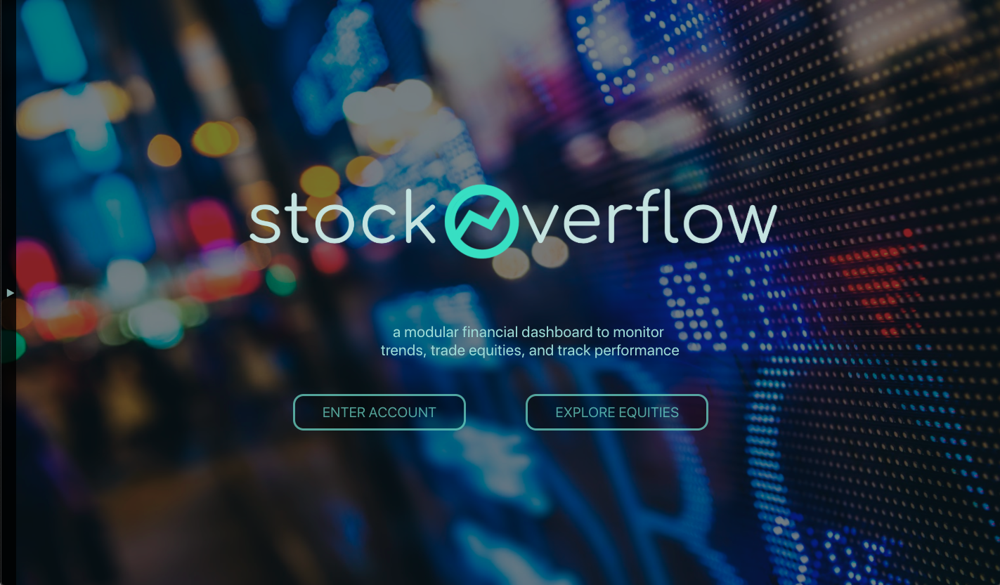
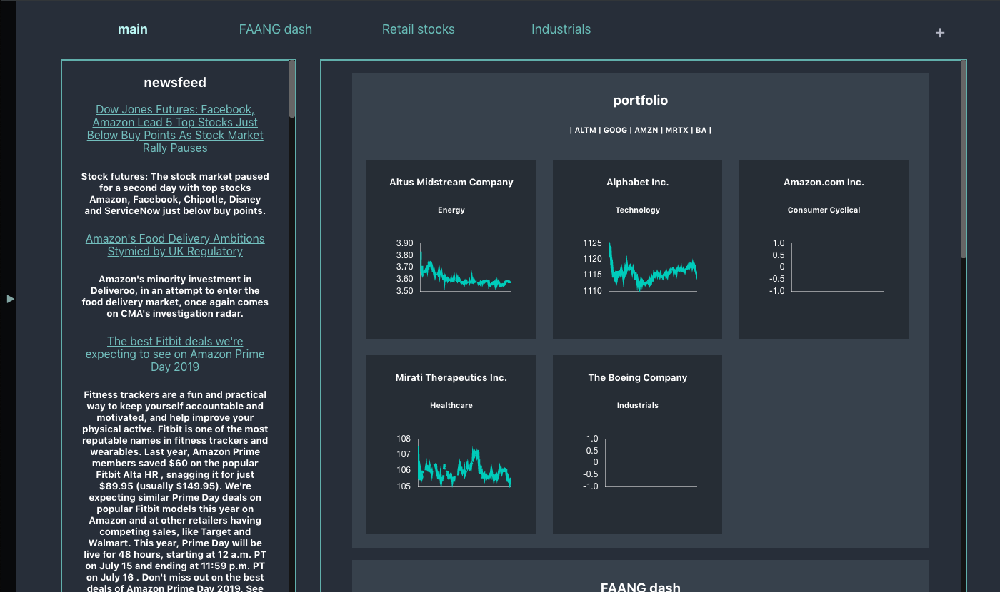
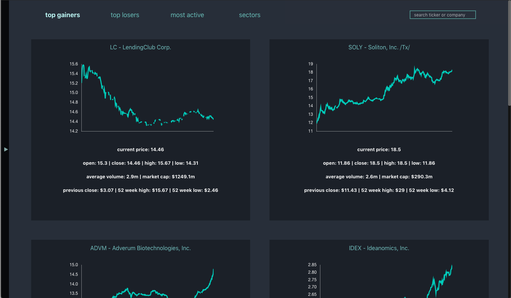

This project was created by Linya Hu.

Click [HERE](https://stockoverflow-app.herokuapp.com/) to see Stock Overflow Live!

## About Stock Overflow

Stock Overflow is a portfolio management app that allows users to create custom watchlists for stocks and manage their stock trades. When you create a new account, your account is defaulted with a 'main' dashboard that contains the summaries of your other stock watchlists.

This app was inspired by the Bloomberg Terminal dashboard.

View the demo of the app [here](https://www.youtube.com/watch?v=IaRqunF6-Y0&t=100s)

## Libraries

Stock Overflow is built with the following:
- [React.js](https://reactjs.org/docs/getting-started.html)
- [react-chartjs-2](https://github.com/jerairrest/react-chartjs-2) an integration of the Chart.js library with React
- [React router](https://github.com/ReactTraining/react-router) for handling navigation between components
- [Redux](https://redux.js.org/) for managing global state
- [Ruby on Rails](https://rubyonrails.org/) for API backend
- Custom CSS styling and design
- [IEX Trading API](https://iextrading.com/developer/docs/) for real-time quotes on over 8,000 stocks and funds

## Future Development

The below features will be worked on and deployed as upgraded versions:
- collapsed positions
- short-selling implementation
- user customization of subportfolios
